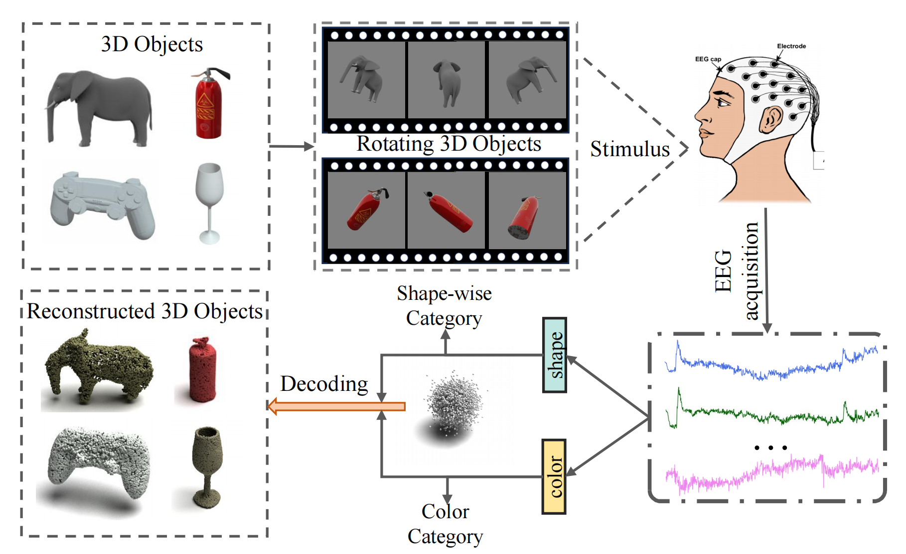
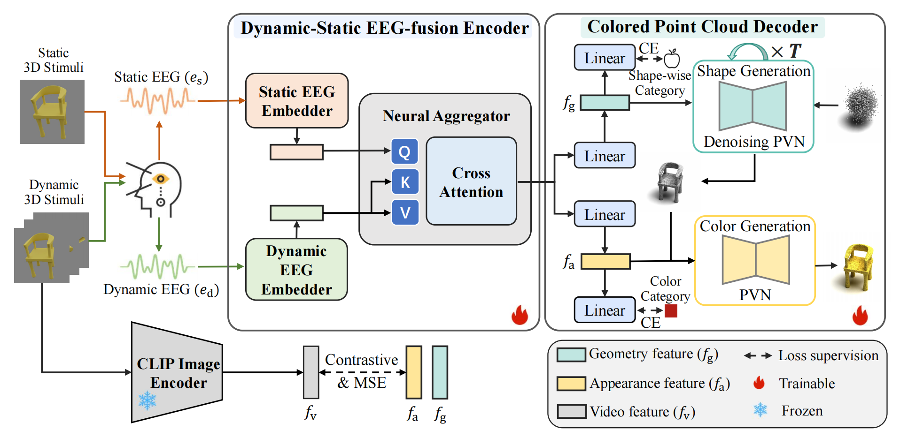
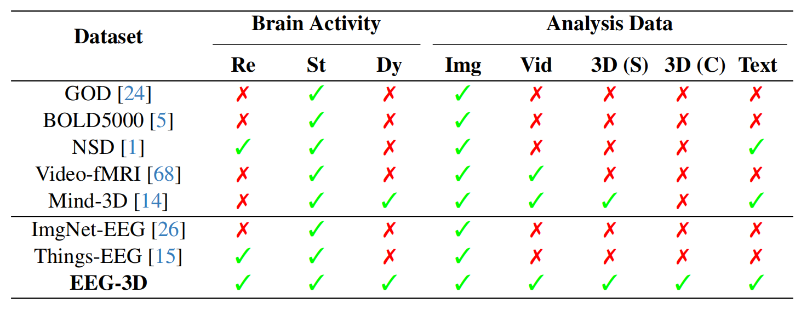
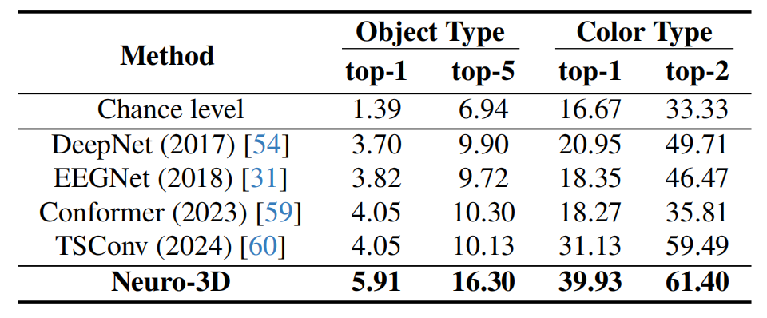
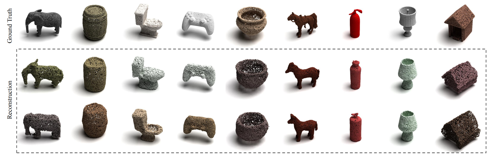
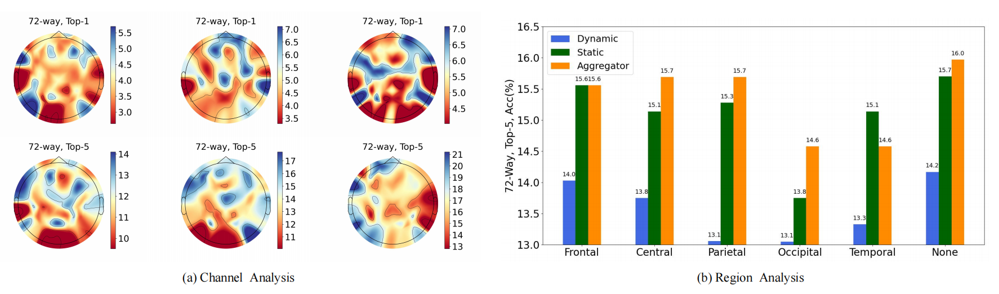

<br>
<p align="center">
<h1 align="center"><strong>Neuro-3D: Towards 3D Visual Decoding from EEG Signals</strong></h1>
  <p align="center">
    Zhanqiang Guo(#)&emsp;
    Jiamin Wu(#)&emsp;
    <a href='https://eeyhsong.github.io/' target='_blank'>Yonghao Song</a>&emsp;
    Jiahui Bu</a>&emsp;
    Weijian Mai</a>&emsp;
    <br>
    Qihao Zheng</a>&emsp;
    <a href='https://wlouyang.github.io/' target='_blank'>Wanli Ouyang*</a>&emsp;
    <a href='https://cf-song.github.io/' target='_blank'>Chunfeng Song*</a>&emsp;
    <br>
    Shanghai AI Laboratory&emsp;Tsinghua University&emsp;The Chinese University of Hong Kong&emsp;
    <br>
    Shanghai Jiao Tong University&emsp;South China University of Technology
  </p>
</p>

## 🏠 About

<p align="center">
  
</p>
We introduce a new neuroscience task: decoding 3D visual perception from EEG signals, a neuroimaging technique that enables real-time monitoring of neural dynamics enriched with complex visual cues.
To provide the essential benchmark, we first present <b>EEG-3D</b>, a pioneering dataset featuring multimodal analysis data and extensive EEG recordings from 12 subjects viewing 72 categories of 3D objects rendered in both videos and images.
Furthermore, we propose <b>Neuro-3D</b>, a 3D visual decoding framework based on EEG signals. This framework adaptively integrates EEG features derived from static and dynamic stimuli to learn complementary and robust neural representations, which are subsequently utilized to recover both the shape and color of 3D objects through the proposed diffusion-based colored point cloud decoder.
To the best of our knowledge, we are the first to explore EEG-based 3D visual decoding. Experiments indicate that Neuro-3D not only reconstructs colored 3D objects with high fidelity,  but also learns effective neural representations that enable insightful brain region analysis.

## 🔥 News
- [2024-11-19] We release the training and inferencing codes.
- [2024-11-19] We release the [paper](https://arxiv.org/abs/2411.12248) of Neuro-3D.
- [2025-03-07] Our paper is accepted to <b>CVPR2025</b>.

## 🔍 Overview

### Framework
<p align="center">
  
</p>

The input static and dynamic signals ($e_\mathrm{s}$ and $e_\mathrm{d}$) are aggregated via the dynamic-static EEG-fusion encoder. Subsequently, the fused EEG features are  decoupled into geometry and appearance features ($f_\mathrm{g}$ and $f_\mathrm{a}$). After aligning with clip image embeddings, $f_\mathrm{g}$ and $f_\mathrm{a}$ serve as guidance for the generation of geometric shapes and overall colors.

### Dataset

<p align="center">
  
</p>

Comparison between <b>EEG-3D</b> and other datasets, categorizing brain activity into resting-state (Re), responses to static stimuli (St) and dynamic stimuli (Dy). The analysis data includes images (Img), videos (Vid), text captions (Text), 3D shape (3D (S)) and color attributes (3D (C)). The EED-3D dataset distinguishes itself from existing datasets by the attributes of <b>Comprehensive EEG signal recordings</b> and <b>Multimodal analysis data and labels</b>.

### Experiment Results
#### Comparison with Related Methods on Classification Task
Please refer to our paper for more results.
<p align="center">
  
</p>

#### Reconstructed Examples
Please refer to our paper for more results.
<p align="center">
  
</p>

#### Analysis of Brain Regions
Please refer to our paper for more results.
<p align="center">
  
</p>

## 📦 Training and Evaluation
### Installation
- Python = 3.9.19
- Pytorch = 2.0.1
- CUDA = 11.8
- Install other packages in `requirements.txt`

### Data Preparation

The data download link will be announced soon. The directory should look like this:

```bash
root_path
├── EEGdata
├──── sub01
├──────── process_data_1s_250Hz.npy
├──────── process_data_6s_100Hz.npy
├── point_cloud
├── video_new
└── clip_feature.pth
```

where `clip_feature.pth` is the CLIP feature corresponding to text, video, and point cloud extracted from the pre-trained model. Run the code to divide the dataset:

```bash
python eeg_data_process/EEG_organization.py
```

### Training

1. The Training of Classification Model
```bash
python classification/retri_shape_color.py --root_path root_path --sub 'sub01'
```
2. The Training of Reconstruction Model

The name of the model saved in step 1 is denoted as `cls_model`, such as  `retri_color_shape_11-05_11-33_VideoImageEEGClassifyColor3_color_video_fea_time_len1`.

```bash
python recon_main.py --data_path root_path --generation_type 'shape' --sub 'sub25' --in_channels 1027 --pretrain_model cls_model
```

3. The Training of Color Prediction Model

```bash
python add_color_main.py --data_path root_path --generation_type 'color' --in_channel 1033 --sub 'sub25' --max_steps 40000 --checkpoint_freq 5000 --pretrain_model cls_model
```

### Inferencing

1. Inferencing of Reconstruction Model

```bash
python recon_main.py --data_path root_path --generation_type 'shape' --task 'sample' --sub 'sub25' --in_channels 1027 --checkpoint_resume chechpoint_path
```

2. Inferencing of Color Prediction Model

```bash
python add_color_main.py --data_path root_path --generation_type 'color' --task 'sample' --in_channel 1033 --sub 'sub25' --checkpoint_resume chechpoint_path --ply_point_path recon_result_path
```

## 🔗 Citation
If you find our work and this codebase helpful, please consider starring this repo 🌟 and cite:
```bibtex
@article{guo2024neuro,
  title={Neuro-3D: Towards 3D Visual Decoding from EEG Signals},
  author={Guo, Zhanqiang and Wu, Jiamin and Song, Yonghao and Mai, Weijian and Zheng, Qihao and Ouyang, Wanli and Song, Chunfeng},
  journal={arXiv preprint arXiv:2411.12248},
  year={2024}
}
```
## 📧 Contact us

If you have any questions about this code, please do not hesitate to contact me.

Zhanqiang Guo: guozq21@mails.tsinghua.edu.cn
